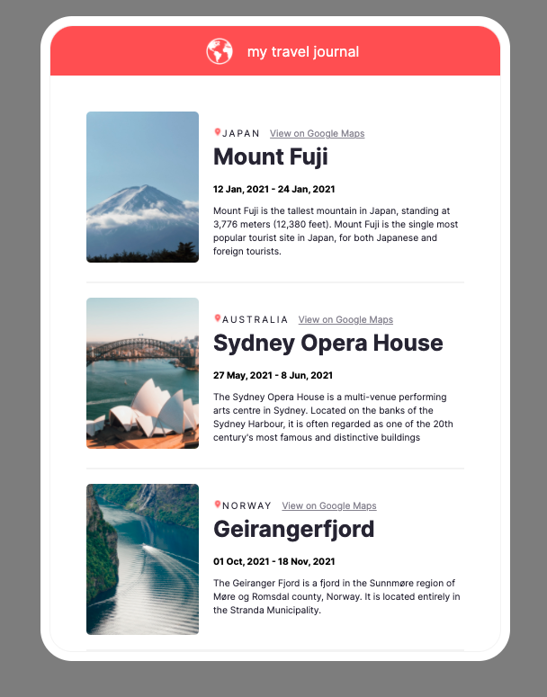

# Scrimba Frontend Career Path - (Personal Project 2/Travel Log - Module 11)

This is a solution to the [Scrimba Frontend Career Path - (Module11-React/Personal Project)](https://scrimba.com/learn/frontend).

## Table of contents

- [Overview](#overview)
  - [The challenge](#the-challenge)
  - [Screenshot](#screenshot)
  - [Links](#links)
- [My process](#my-process)
  - [Built with](#built-with)
  - [What I learned](#what-i-learned)
  - [Continued development](#continued-development)
  - [Useful resources](#useful-resources)
- [Author](#author)
- [Acknowledgments](#acknowledgments)


## Overview

### The challenge

Create a react page that passes props and consumes JSON data, following a figma file and without any instructor guidance

After this Challenge I should be able to Code/Understand:

- Figma files
- React
- JSON
- React props

### Screenshot



### Links

- Solution Github URL: [https://github.com/Rod-Barbosa/travelog](https://github.com/Rod-Barbosa/travelog)
- Live Site URL: [https://rodrigo-travel-log.netlify.app/](https://rodrigo-travel-log.netlify.app/)
## My process

### Built with

- React
- Figma
- JavaScript
- JSON

### What I learned

There is no easy way of mimicking last-child CSS sudo-class in React.
I tried conditional rendering.. but it would mean passing so many extra props to hide one line ... I went with just leaving the line there and moving on. Pixel perfect is the enemy of perfect.

```React
<hr className="trips--border-bottom" />
```
Combined with:
```CSS
.trips--border-bottom{
    border: .1px solid #F5F5F5;
    /* width: 80%; */
    margin: 0 2.5em;
}
```

The map function may seem too big, but readability is much better than using the {...trip} spread object for destructuring construction. No wonder my preferences is towards human readability.

```React
    const tripsArr = tripsData.map((trip, counter)=>

        <Trips 
            key={counter}
            title={trip.title}
            location={trip.location}
            googleMapsUrl={trip.googleMapsUrl}
            startDate={trip.startDate}
            endDate={trip.endDate}
            description={trip.description}
            imageUrl={trip.imageUrl}
            jpegImage={trip.jpegImage}
        />
    )

    return (
        <div className="container">
            <Navbar />
            {tripsArr}
        </div>
```

### Continued development

Fetching hte unsplash API is a low hanging fruit for this project. That would make the travelog more interactive. Until then, it is nice hte way it is

### Useful resources

- [Original Figma file](https://www.figma.com/file/QG4cOExkdbIbhSfWJhs2gs/Travel-Journal?node-id=0%3A1) - It isn't pixel perfect, which is actually better than pixel perfect
- [Pixlr for getting logo on the right color](https://pixlr.com/br/x/) -Suck it photoshop
- [For the pictures](https://unsplash.com/photos/JmuyB_LibRo) - I could have consumed the API with fetch, but setting up the life struckture was more challenging

## Author

- Website - [Rodrigo Portfolio](https://www.gelatodigital.com)
- Frontend Mentor - [@Rod-Barbosa](https://www.frontendmentor.io/profile/Rod-Barbosa)
- Github - [@Rod-Barbosa](https://github.com/Rod-Barbosa)

## Acknowledgments

